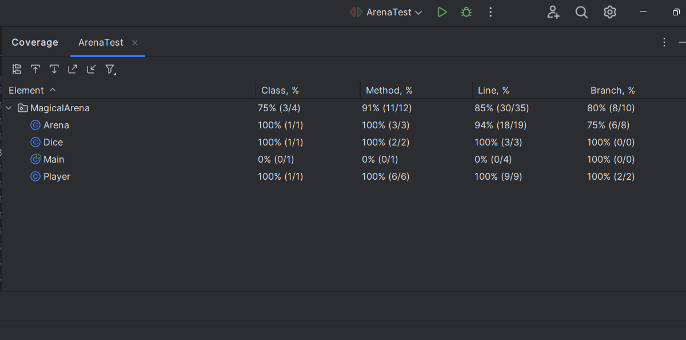

---

# Magical Arena

## Description
The **Magical Arena** project simulates a battle between two players in a magical arena. Each player has attributes for health, strength, and attack. Players take turns attacking and defending, and the game continues until one player's health reaches zero.

### Features
- **Player Attributes**: Each player has health, strength, and attack attributes.
- **Turn-Based Combat**: Players attack and defend in turns.
- **Dice Rolls**: Both attacking and defending actions are influenced by dice rolls.
- **Dynamic Damage Calculation**: Damage is calculated based on player attributes and dice outcomes.
- **Game End Condition**: The game ends when one player's health reaches zero.

### Rules of the Game
1. Players attack in turns.
2. The attacking player rolls an attacking die, and the defending player rolls a defending die.
3. The attack value multiplied by the outcome of the attacking die roll determines the damage created by the attacker.
4. The defender's strength value multiplied by the outcome of the defending die roll determines the damage defended by the defender.
5. The excess damage (if any) reduces the defender's health.
6. The game ends when any player's health reaches zero.
7. The player with lower health attacks first at the start of a match.

### Example Scenario
- **Player A**: 50 health, 5 strength, 10 attack
- **Player B**: 100 health, 10 strength, 5 attack
- **Dice**: Both attacking and defending dice are 6-sided with values ranging from 1 to 6.

**Turn 1:**
- Player A attacks and rolls a 5.
- Player B defends and rolls a 2.
- Attack damage: 5 * 10 = 50
- Defending strength: 10 * 2 = 20
- Player B's health is reduced by 30 to 70.

**Turn 2:**
- Player B attacks and rolls a 4.
- Player A defends and rolls a 3.
- Attack damage: 4 * 5 = 20
- Defending strength: 5 * 3 = 15
- Player A's health is reduced by 5 to 45.

And so on...

## How to Run
1. **Clone the repository**:
   ```sh
   git clone https://github.com/shafa45/MagicalArena
   cd MagicalArena
   ```

2. **Compile the project**:
   ```sh
   javac -d bin src/main/java/MagicalArena/*.java
   ```

3. **Run the simulation**:
   ```sh
   java -cp bin MagicalArena.Main
   ```

## Unit Tests
To run the unit tests, use the following commands:

1. **Compile the tests**:
   ```sh
   javac -cp .:junit-5.7.0.jar:hamcrest-core-1.3.jar -d bin src/test/java/MagicalArena/*.java
   ```

2. **Run the tests**:
   ```sh
   java -cp .:bin:junit-5.7.0.jar:hamcrest-core-1.3.jar org.junit.runner.JUnitCore MagicalArena.ArenaTest
   ```

## Test Coverage


